# Accuracy monitoring for chart extraction — design & rollout plan

> **Status**: Phases 1-2 are implemented in `eval/` — see `eval/README.md`.
> They deviate from §2/§6/§8 below in a few deliberate ways: rather than
> copying fixtures into a new `ground_truth/canonical/` tree, the manifest
> (`eval/ground_truth/v1.jsonl`) references the existing `tests/data/<category>/`
> fixtures in place, and ground truth stayed in the wide CSV format
> (`date;series1;series2;...`) `tests/data_generation.py` already produces
> rather than migrating to long format — both avoid duplicating data that was
> already in the right shape. The metrics history db (`eval/history/eval.db`)
> is recorded by an explicit `--record` flag, not a nightly job — no scheduled
> full run exists yet, so the dashboard only grows when someone runs it.
> Phases 3-4 (the `promote-to-testset` endpoint, the production feedback loop)
> are still just this plan, not yet built.

Goal: a growing, versioned ground-truth test set plus an eval harness that tracks
extraction quality (MAE, Resolved Fraction, …) over time and per commit, and a
correction workflow that turns manually-fixed charts into new ground truth. This
builds on what already exists rather than replacing it:

- `tests/data_generation.py` already produces synthetic charts + CSV ground truth
  (`linear_scaled`, `log_scaled`, `multiline`, `scrab_style`, `dense_crossing`,
  `crossing_multiline`, `in_area_text`).
- `api/api.py` already has a correction UI: upload → extract → "modify mode" with
  datapoint snapping, segment select/delete, undo/redo (`SeriesEditBody`,
  `SeriesEditsBody`), and per-series rename/remove.
- `docs/series-gaps-diagnosis.md` already reasons in these exact terms (resolved
  vs. `None` columns per series), so Resolved Fraction is a natural fit, not a new
  concept.

The plan below formalizes the dataset, adds an eval harness and a metrics history,
and wires the existing correction UI into a "save as ground truth" flow — in four
phases so value lands incrementally instead of needing a big-bang rebuild.

## 1. System overview

```mermaid
flowchart TB
    subgraph Sources["Ground-truth sources"]
        SYN["Synthetic generator\ntests/data_generation.py"]
        PROD["Production uploads\ncorrected via modify mode"]
    end

    subgraph GT["Ground-truth store (versioned)"]
        STAGING["staging/\nnewly-promoted, unreviewed"]
        CANON["canonical/\nreviewed, tagged, versioned (vN)"]
    end

    subgraph Eval["Eval harness"]
        RUNNER["run_eval.py\nextract_chart() vs ground truth"]
        METRICS["metrics.py\nMAE, RMSE, Resolved Fraction,\nseries-count accuracy, x-alignment"]
    end

    subgraph History["Metrics history"]
        DB[("eval.db (SQLite)\none row per chart per run")]
        DASH["Dashboard\ntrend lines per category, per commit"]
    end

    subgraph CI["CI"]
        PR["PR job: fast subset,\nregression gate vs. main baseline"]
        NIGHTLY["Nightly job: full set,\nupdates baseline + dashboard"]
    end

    SYN --> CANON
    PROD -- "annotator promotes" --> STAGING --> CANON
    CANON --> RUNNER --> METRICS --> DB --> DASH
    PR --> RUNNER
    NIGHTLY --> RUNNER
```



Four pieces, each independently useful:

1. **Ground-truth store** — a manifest-driven dataset, versioned, with a clear
   staging→canonical promotion step so unreviewed corrections can't silently
   corrupt the baseline.
2. **Eval harness** — a pure function of (pipeline version, dataset version) →
   metrics report. Runs identically in CI and locally.
3. **Metrics history** — every run's report is appended, keyed by git SHA, so
   "how did commit X affect accuracy" is a query, not an investigation.
4. **Correction → ground truth loop** — the existing modify-mode UI already
   produces corrected series; the only new part is persisting that correction
   as a tagged, reviewable dataset entry instead of throwing it away.

## 2. Ground-truth dataset format

One directory per chart, not just an image+CSV pair — metadata is what makes the
dataset queryable by category/source/difficulty later:

```
ground_truth/
  canonical/
    v1/
      manifest.jsonl              # one line per chart, see below
      charts/
        scrab_style_0001/
          image.png
          series.csv              # date;series_name;value (long format)
          meta.json
  staging/
    <same layout, pending review>
```

`meta.json` per chart:

```json
{
  "id": "scrab_style_0001",
  "source": "synthetic",            // or "production" / "manual-upload"
  "category": "scrab_style",        // linear_scaled, log_scaled, multiline,
                                     // dense_crossing, in_area_text, real_world, ...
  "axis_scale": "log",
  "n_series": 3,
  "added_at": "2026-08-23",
  "annotator": null,                // email, for production-sourced entries
  "correction_fraction": null,      // see §5 — how much of the raw extraction
                                     // the annotator had to touch
  "notes": ""
}
```

`series.csv` is deliberately the same long-format shape as the existing
`tests/data/*.csv` fixtures (`date;series_name;value`) — no format migration
needed for the synthetic set, it's already in the right shape.

Why manifest-per-dataset (`manifest.jsonl`) rather than scanning directories:
eval runs need a stable, explicit list of what's "in v1" vs "in v2" so a report
is reproducible even as `staging/` keeps changing underneath it.

**Versioning**: canonical is tagged (`v1`, `v2`, …) whenever a batch of promoted
charts lands. Eval reports record which dataset version they ran against, so
"MAE went up" can be disambiguated between "the pipeline regressed" and "the
dataset got harder" (e.g. `docs/series-gaps-diagnosis.md`'s dense-crossing cases
made it in). Start with plain git for storage (current images are tens of KB,
same order as today's `tests/data/`); revisit only if the corpus grows past
roughly a few hundred MB — at that point move `charts/` to Git LFS or object
storage and keep only the manifest + metadata in git.

## 3. Metrics

Computed per chart, then aggregated per category and overall. All defined over
the *jointly resolved* x-positions between prediction and ground truth unless
noted:

| Metric | Definition | Purpose |
|---|---|---|
| **Resolved Fraction** | `resolved_pred_points / total_gt_points` | Coverage — is the pipeline finding a value at all, independent of whether it's correct. Directly reuses the `None`-count framing already used in `docs/series-gaps-diagnosis.md`. |
| **MAE / RMSE** | over jointly-resolved points, in the chart's own value units | Value accuracy where a value exists. |
| **Normalized MAE** | `MAE / (gt.max() - gt.min())` | Comparable across charts with wildly different scales ($ vs % vs index). |
| **Series-count accuracy** | `predicted_n_series == gt_n_series` | Multiline-specific: did it even find the right number of lines (`src/multiline.py`). |
| **X-alignment error** | mean date offset between a predicted point and its nearest GT point | Catches axis-calibration bugs (`src/scale.py`, `build_axis_ticks`) separately from value errors. |
| **Runtime** | wall-clock per chart | Regression guard for perf, not just accuracy. |

Report shape (one JSON per run):

```json
{
  "run_id": "2026-08-23T10:15:00Z",
  "git_sha": "3bf13cf",
  "dataset_version": "v1",
  "overall": {"resolved_fraction": 0.94, "mae_norm": 0.021, "n_charts": 340},
  "by_category": {
    "scrab_style": {"resolved_fraction": 0.88, "mae_norm": 0.035, "n_charts": 40},
    "linear_scaled": {"resolved_fraction": 0.99, "mae_norm": 0.004, "n_charts": 30}
  },
  "per_chart": [ {"id": "scrab_style_0001", "resolved_fraction": 0.86, ...} ]
}
```

`per_chart` is what makes "which specific chart regressed" a lookup instead of a
re-run with print statements.

## 4. Eval harness

New top-level module, separate from `tests/` — it's slow (runs OCR + extraction
over the whole dataset) and reads external data, so it shouldn't run on every
`pytest` invocation the way unit tests do:

```
eval/
  __init__.py
  metrics.py        # pure functions: resolved_fraction(), mae(), align_series()
  run_eval.py        # CLI: loads manifest, calls src.chart_extraction, writes report
  history.py         # append/query eval.db
  report.py          # renders dashboard (see §6)
```

`run_eval.py` reuses `src.chart_extraction.extract_chart` / `extract_time_series`
directly (same code path as `api/api.py` and `scripts/visualize_functions.py`) —
no separate extraction implementation to keep in sync.

```bash
python -m eval.run_eval --dataset ground_truth/canonical/v1 --out eval/history/
```

## 5. Correction → ground truth (the "nice to have" service)

Rather than a separate service, extend the existing chart API — it already has
everything needed except persistence:

- New endpoint `POST /api/charts/{id}/promote-to-testset`: takes the chart's
  current corrected state (post-modify-mode, same data `SeriesEditsBody` already
  operates on), plus category/notes from the request body, and writes it into
  `ground_truth/staging/` as a new manifest entry.
- `correction_fraction` in `meta.json` — the fraction of datapoints the
  `SeriesEditBody` edits actually touched — is computed for free from the edit
  log already kept for undo/redo. It's a useful signal on its own: charts that
  needed heavy correction are exactly the ones worth prioritizing for review,
  and its trend over time is a cheap proxy for "how good is the raw pipeline in
  production" even before those charts are reviewed and promoted.
- Promotion `staging/ → canonical/vN` is a separate, explicit step (a small
  script or a reviewer-facing page listing staging entries with a diff against
  the raw extraction) — never automatic. Ground truth is only as good as its
  review; auto-promoting unreviewed corrections would let a bad manual edit
  quietly become the new "truth" that all future accuracy is measured against.

This makes the annotation tool the same UI users already correct charts in,
rather than a second bespoke drawing tool — less to build, and it also dogfoods
the correction UX (a rough modify-mode flow shows up as annotator friction long
before a user complains about it).

## 6. Metrics history & dashboard

- Storage: SQLite (`eval/eval.db`), one row per `(run_id, chart_id, metric)` —
  queryable with plain SQL/pandas, no server to run. Migrate to Postgres only if
  concurrent writers or remote access become a real need.
- Dashboard: a static HTML report generated by `eval/report.py` after each run
  (trend lines per category over `git_sha`/time, using the same
  matplotlib already a project dependency via `scripts/visualize_functions.py`)
  — committed to `docs/eval-history/latest.html` or published as a build
  artifact. A Streamlit app is the natural upgrade if interactive filtering
  (by category, by date range) becomes worth the extra moving part; start
  static.
- If the team later wants a standard, batteries-included tracking UI instead of
  a hand-rolled one, MLflow's tracking server is the natural drop-in for this
  exact shape (params = git sha + dataset version, metrics = the table in §3)
  — mentioned as an alternative to building `report.py`, not a requirement.

## 7. CI integration

- **On PR**: run the harness against a fast subset (synthetic categories only —
  seconds, not minutes) and compare aggregate metrics to the last full run on
  `main`. Fail the check if any category's Resolved Fraction drops more than a
  fixed threshold (e.g. 2 points) or normalized MAE rises more than ~10%
  relative, without an explicit override. Post the per-category delta table as
  a PR comment.
- **Nightly**: run the full canonical set (including any newly-promoted
  production charts), append to `eval.db`, update the dashboard, and refresh
  the "main baseline" the PR job compares against.
- This mirrors how the synthetic fixtures already got built — `dense_crossing`
  and `crossing_multiline` were added specifically to pin down bugs found in
  `docs/series-gaps-diagnosis.md` — the eval harness just makes "did this
  regress any of those" a number instead of a manual re-read of the diagnosis
  doc.

## 8. Phased rollout

1. **MVP** — manifest schema + migrate `tests/data/*` into it; `eval/metrics.py`
   and `run_eval.py`; reports as plain JSON files under `eval/history/`, no DB
   yet. Add the PR regression-gate CI job. This alone gives "did my change hurt
   accuracy" on every PR.
2. **History + dashboard** — SQLite `eval.db`, `report.py`, nightly full run.
3. **Ground-truth authoring** — `promote-to-testset` endpoint, staging area,
   review/promote flow.
4. **Production feedback loop** — surface `correction_fraction` as an
   always-on production quality signal, and add an opt-in "contribute this
   correction" prompt after modify-mode edits, routing straight into staging.

Each phase is independently shippable and useful on its own — the plan doesn't
depend on later phases to deliver value early.
